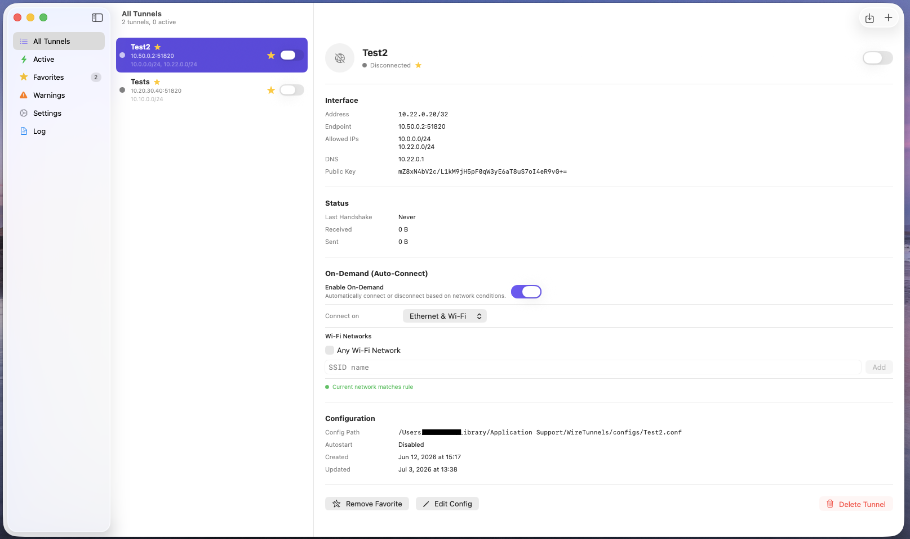
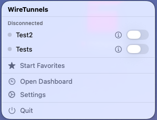
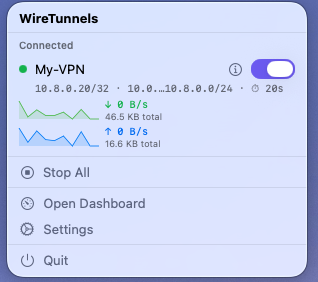
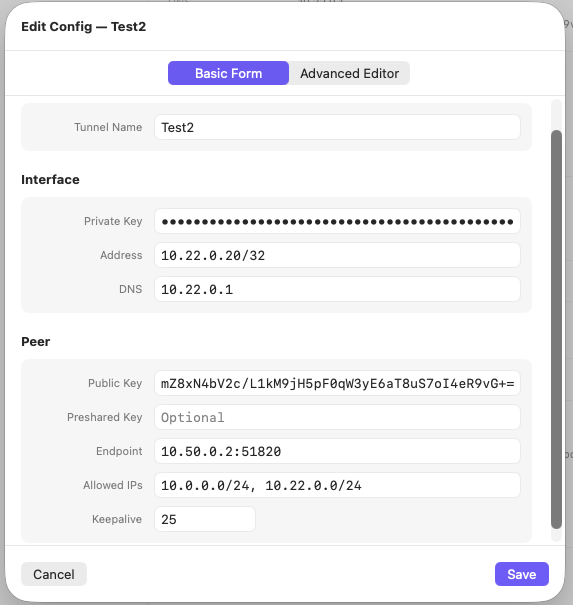
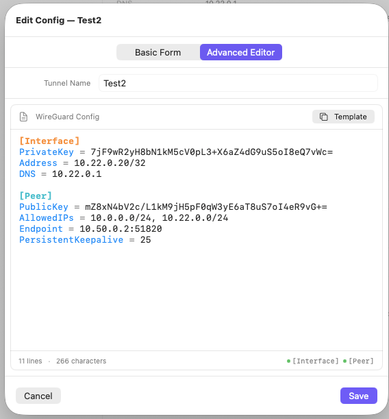
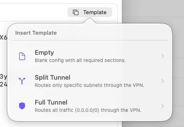
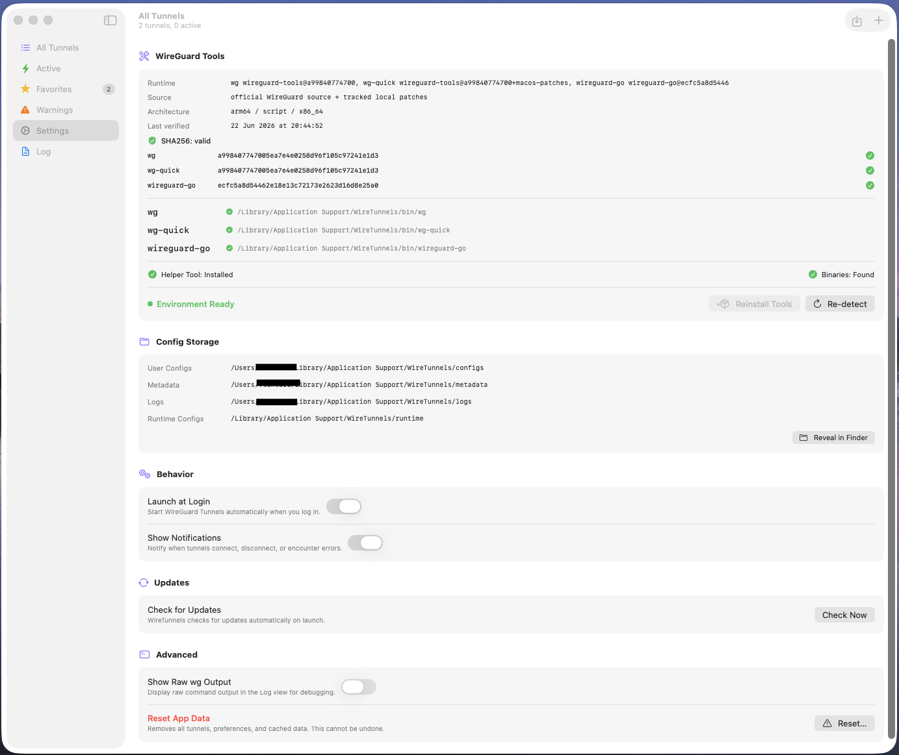
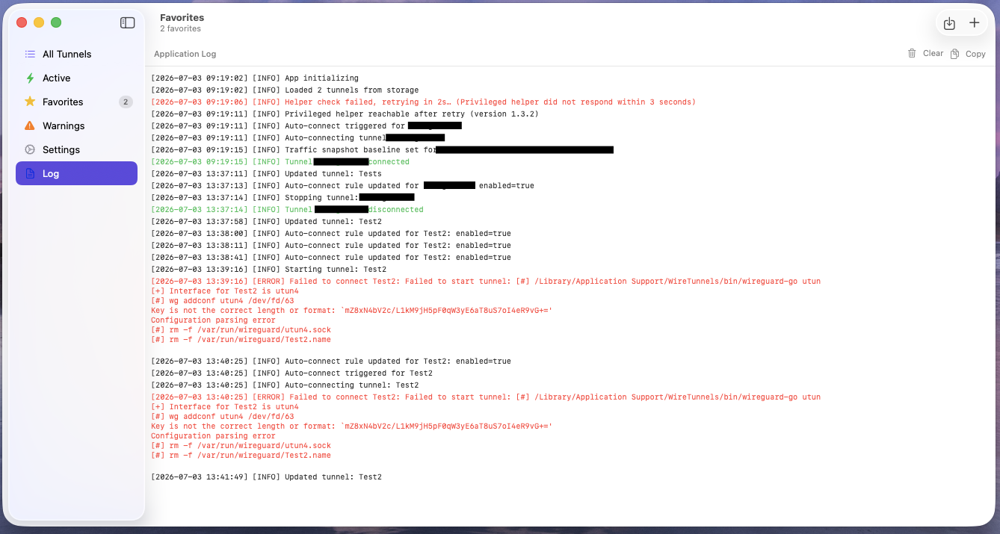
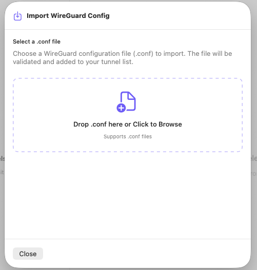

# WireTunnels

<p align="center">
  
</p>

<h3 align="center">
  Multi-tunnel WireGuard management for macOS.
</h3>

<p align="center">
  A native menu bar app built to connect, monitor and control multiple WireGuard tunnels without touching the terminal.
</p>

<p align="center">
  
  
  
  
</p>

<p align="center">
  <a href="#download">Download</a> ·
  <a href="#features">Features</a> ·
  <a href="#screenshots">Screenshots</a> ·
  <a href="#security--privacy">Security & Privacy</a> ·
  <a href="#installation">Installation</a> ·
  <a href="#license">License</a>
</p>

---

## The problem

WireGuard is fast, lightweight and reliable.
But on macOS, managing multiple active tunnels can quickly become uncomfortable.

You either use the official app with limited multi-tunnel flexibility, or you fall back to terminal commands, scripts and manual configuration files.

WireTunnels brings that workflow into a clean native macOS app.

---

## What WireTunnels does

WireTunnels lets you manage all your WireGuard tunnels from one place.

Use the menu bar for quick actions, open the dashboard for full visibility, import existing configurations, create new ones from templates, monitor live metrics and quickly understand route or DNS conflicts before they become a problem.

---

## Download

<p align="center">
  <strong>Ready to manage all your WireGuard tunnels from one native macOS app?</strong>
</p>

<p align="center">
  Download WireTunnels, move it to your Applications folder, import your tunnels and connect.
</p>

<p align="center">
  <a href="https://github.com/FMDigitech/WireTunnels/releases/latest">
    
  </a>
</p>

<p align="center">
  <a href="https://github.com/FMDigitech/WireTunnels/releases/latest">
    <strong>Get the latest release →</strong>
  </a>
</p>

WireTunnels is distributed as a simple macOS `.zip` file.

text
1. Download the latest release
2. Unzip the file
3. Move WireTunnels.app to Applications
4. Open WireTunnels
5. Import or create your tunnels
6. Connect from the menu bar

---

## Screenshots

<p align="center">
  
</p>

<p align="center">
  
</p>

<p align="center">
  
</p>

<p align="center">
  
</p>

<p align="center">
  
</p>

<p align="center">
  
</p>

<p align="center">
  
</p>

<p align="center">
  
</p>

<p align="center">
  
</p>

---

## Features

### Native macOS experience

WireTunnels is built as a real macOS app, with a menu bar controller, desktop dashboard, settings, shortcuts and a clean interface that feels at home on macOS.

### Multi-tunnel control

Connect and disconnect multiple tunnels individually, all at once, or only your favorites.

### Built-in configuration workflow

Import existing `.conf` files or create new tunnels using the basic editor, advanced editor or ready-to-use templates.

### Live visibility

Monitor tunnel status, latest handshake, endpoint, interface, DNS, Allowed IPs and traffic usage in real time.

### Auto-start and auto-connect

Launch WireTunnels automatically and connect selected tunnels on startup.

### Favorites and quick actions

Mark tunnels as favorites and quickly start or stop all favorite tunnels from the menu bar or with shortcuts.

### Smarter warnings

WireTunnels helps identify common problems such as full-tunnel conflicts, overlapping routes and DNS inconsistencies.

---

## Security & Privacy

WireTunnels is designed to run locally on your Mac.

* Tunnel configurations are stored locally on your machine.
* WireTunnels does not require an account.
* WireTunnels does not collect analytics.
* WireTunnels does not send your VPN configurations to external servers.
* Private keys remain inside your local configuration files.
* Network status and tunnel metrics are read locally from WireGuard tooling.
* Privileged operations are handled only when required to start, stop or manage tunnels.

Always review imported WireGuard configuration files before connecting, especially if they were provided by third parties.

---

## Installation

1. Download the latest version from the [Releases page](https://github.com/FMDigitech/WireTunnels/releases/latest).
2. Open the downloaded `.zip` file. It will unzip into an app.
3. Drag `WireTunnels.app` into the `Applications` folder.
4. Open the app from `Applications`.
5. Import or create your WireGuard tunnel configurations.
6. Connect your tunnels from the menu bar or dashboard.

> The app comes as a simple zip file for macOS. Unzip it and move it to Applications.

---

## Status

WireTunnels is currently focused on WireGuard tunnel management for macOS.

Future versions may include additional diagnostics, improved routing analysis, better DNS conflict detection and extended automation features.

---

## Support

For any request, information, or to report errors, write to:

```text
f.tontaro@fmdigitech.com
```

You can also open an issue on the project repository.

---

## License

WireTunnels is licensed under the Apache License 2.0.

---

## Disclaimer

WireTunnels is an independent project.
WireGuard is a registered trademark of Jason A. Donenfeld.
